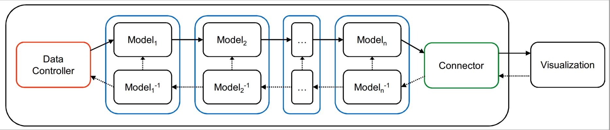

# Overview
The pipeline performs all the back end data processing for the visualizations. Each pipeline instantiation executes as a single Python script and is made up of three main pieces: a data controller, a series of models, and a connector. The data controller handles loading and accessing whatever data is to be visualized. The models control how the data is processed and sent to the client, as well as how the client's interactions change these models. Finally, the connector mediates connections to the visualization directly or to a visualization controller such as the Node.js server.

# Installation

For all platforms, Python 2.7 must be installed. It can be installed from their website [here](https://www.python.org/downloads/release/python-2712/). This install should come with pip, the Python package manager. If you can run pip from the command line, you are ready to proceed. If pip isn't found, you can install it by following the instructions [here](https://pip.pypa.io/en/stable/installing/). Make sure pip is updated to the latest version by running:

`pip install --upgrade pip`

Then you can install the package and all the dependencies by running the following command from the root directory:

`pip install .` (If you are going to develop you can use `pip install -e .`)

## Python Compatibility Issues
Previous resarchers on this project have tried to use [Anaconda](https://www.continuum.io/downloads) as a Python distribution with preinstalled packages. However, do note that using Anaconda may cause issues with installing and running this project correctly, especially if Anaconda is installed after this project.

## Note for Windows
When installing on Windows platforms, the scipy package will not install properly using the setup file. It must be installed manually, along with its dependency numpy. One option is to use a Python distribution that has these packages preinstalled, such as [Anaconda](https://www.continuum.io/downloads). However, do note that using Anaconda may cause issues with installing and running this project correctly, especially if Anaconda is installed after this project. If you already have the traditional Python distribution installed, the best way to install these packages is by downloading them from the site [here](http://www.lfd.uci.edu/~gohlke/pythonlibs/). Download the files `numpy-1.11.1+mkl-cp27-cp27m-win_amd64.whl` and `scipy-0.17.1-cp27-cp27m-win_amd64.whl` (or the 32-bit version if that's the Python version you're running), and run the following commands in the directory these files are in:

`pip install numpy-1.11.1+mkl-cp27-cp27m-win_amd64.whl`

`pip install scipy-0.17.1-cp27-cp27m-win_amd64.whl`

Then run the `pip install .` and everything should install correctly.

# Pipeline components
Each of the three main components, Models, Data Controllers, and Connectors, have a base class defined within the `pipeline` module. New instances of these components simply need to overwrite the methods defined in these classes as they are described in the comments. The structure of a pipeline can be seen in the following figure:



## Data Controller
The Data Controller mediates access to whatever underlying data is being visualized. While essentially operating as a Model itself, it has one extra key function: its `get` method. Visualizations can use this `get` method to directly access the underlying data or metadata without having to run an iteration of the pipeline. 

## Models
Models are the main data processing components of a pipeline. They have two main pieces: the forward algorithm and the inverse algorithm. User interactions trigger running all inverse algorithms along the pipeline in order to interpret the interaction. Each Model is capable of short circuiting itself, which cuts the pipeline short and starts the forward pipeline immediately from that same Model. The forward algorithms for each model use the new parameters learned by the inverse algorithms. After each forward algorithm is run, the resulting data is passed back to the visualization through the connector.

## Connector
The Connector is in charge of communication between the pipeline and the visualization. It can use whatever means its decides to allow visualizations to run algorithms within the pipeline and retrieve data directly through the `get` functionality.

# User Guide

## Creating a Pipeline
Creating a pipeline is straight forward. First, you create a new instance of a pipeline. Then, you create instances of all the models you want, along with a data controller and a connector. Finally, you add all these pieces to the pipeline and start it. This is all exemplified in the following example:

```python
# Create a Pipeline object from the nebula.pipeline module
pipeline = nebula.pipeline.Pipeline()

# Create an ActiveSetModel object from the nebula.model module, starts out empty
relevance_model = ActiveSetModel()
    
# Create a SimilarityModel object from the nebula.model module, which does 
# forward and inverse MDS
# projections and stores the current set of similarity weights
similarity_model = SimilarityModel()

# Create a CSVDataController object from the nebula.data module, providing
# a CSV file to load data from and the path to a folder containing the raw
# text for each document. 
# IMPORTANT: The CSV file should not be changed hereafter
data_controller = CSVDataController(csvfile, raw_folder)

# Create a ZeroMQConnector object from the nebula.connector module, which
# defines a method for listening for the three types of user defined 
# messages: update, get, and reset. 
connector = nebula.connector.ZeroMQConnector(port=int(sys.argv[1]))

# Next we add the models to the pipeline. New models would be added here.
# The order that the models are
# added is the order in which they are executed in the forward pipeline.
# IMPORTANT: They are executed in reverse order in the inverse pipeline
pipeline.append_model(relevance_model)
pipeline.append_model(similarity_model)
    
# Note: a pipeline contains exactly one data controller
pipeline.set_data_controller(data_controller)
    
# Note: a pipeline contains exactly one connector
pipeline.set_connector(connector)
    
# Starts the pipeline, running the setup for the data controller and each
# model, and then tells the connector to start listening for connections.
# The pipeline can take command line arguments to set user defined model
# parameters.
pipeline.start(sys.argv[4:])
```

This projet contains several data controllers, models, and connectors available for use. Here we describe the basics of each. You can find more details in the documentation for each module. However, note that any additions to the module may require rerunning `pip install -e .`.

### Current Data Controllers

#### CSVDataController
This data controller loads high dimensional data from a CSV file, where each row indicates a data point and each column represents an attribute of the data. The first row should be attribute names, and the first column should be an ID for each point. Optionally, when working with text data, a folder containing the raw text of each document can be specified. This folder should contain a text file for each document, with a filename of "*id*.txt". Then the raw text can be queried for from the visualization using a `get` command.

#### \[Deprecated\] TwitterDataController
This streams live tweets into the visualization using the Twitter API. The filter to search for can be set through an interaction, and all tweets that come in matching that filter are then buffered and eventually sent to the visualization. To use this data controller again, it needs to be properly reconnected to a Twitter account.

#### ESDataController
This connects the pipeline to an Elasticsearch database, which must be run separately (using the Nebula-Elasticsearch repository). This data controller and the database itself communicate with each other over a predefined port.

### Current Models

#### SimilarityModel
Performs forward and inverse MDS projection of the data. The forward projection is done using the sklearn package. The inverse projection is done using a Java library we created. This algorithm is in the process of being ported to Python, so this Java code will soon no longer be required. The inverse projection results in a new set of attribute weights, which are used during the next forward projection of the data.

#### CompositeModel
Extends the SimilarityModel by adding attributes to the project data. It uses a [composite matrix approach](https://ieeexplore.ieee.org/abstract/document/7194836?casa_token=sis8-ae8g74AAAAA:id-TgCxD_N-gj0nAN4k-yx0J9lHt4ni84zIZUxu2YDwrsDGpJ5n8kIYxRo01zm5PLsGNDACuZw), forming a pairwise distance matrix that includes attributes as data points. Only attributes that have a certain amount of weight to them are included. The inverse projection is the same as the SimilarityModel.

#### AndromedaModel
Extends the SimilarityModel to provide more of the features from the Andromeda tool. It adds the interaction of manipulating attribute weights directly.

#### ActiveSetModel
Uses a relevance-based approach to filter down a large set of data points to a smaller set to be visualized. It interprets three basic interactions: text queries that are matched to attribute names to influence weights, user indicated changes to document relevance to affect the weights of attributes in that document, and document deletion.

An "active set" of documents is stored, which is all the documents currently being considered to send down the pipeline. The most relevant documents are placed into the "working set", which is what is currently being seen in the visualization.

#### ImportanceModel
This model is similar to the ActiveSetModel with the exception that this model relies on relevance calculations to filter documents and attributes to be visualized. Interactions may also occur on either the documents or the attributes.

#### CorpusSetModel
Similar to the ActiveSetModel, but acts as an asynchronous model, so all computations are done in a background thread and not within the synchronous pipeline loop. It is designed to be used in conjunction with the ActiveSetModel. This allows for a larger set of documents to be iterated over without affecting the response time of the pipeline. The main limitation is that results from this model will always be at least one interaction behind, so a text query may result in new documents placed in the "active set", but they cannot be moved to the "working set" and sent to the visualization until the next interaction occurs.

### Current Connectors

#### ZeroRPCConnector
Establishes a zerorpc server with RPC calls for ``update``, ``get``, and ``reset``. Allows for simple communication with a Node.js server, but does not allow for asynchronous pushes from the pipeline.

#### ZeroMQConnector
Creates a ZeroMQ PAIR socket and listens for a connection. Messages are encapsulated into an RPC-like fashion, but it allows for asynchronous pushes.

# Developer Notes
Development of new components or modifying current ones is fairly simple. The project is structured as a single Python package, called `nebula`. Within this package are four main modules: `pipeline`, `data`, `model`, and `connector`. The purpose of each are described below.

## Modules

### nebula.pipeline
This module contains the `Pipeline` class which has all the logic for putting together and running a pipeline. It mediates communication between each piece of the pipeline, and is the core piece of the framework. As seen in the example above, to start a pipeline, you simply need to instantiate a `Pipeline` object, add the necessary modules to it, and tell it to start.

This module also contains the base classes for the three main modules, `DataController`, `Model`, and `Connector`. Each implementation of one of these modules should extend the appropriate base class and override the necessary methods. All methods that can be overridden to affect the behavior of a module is listed out in each base class.

### nebula.data
This module contains all the current implementations of data controllers. New data controllers should be added to the `data_controller` directory. This directory also contains `nltkStopwords.txt`, which is used by the TwitterDataController to filter out additional stopwords from tweets. The current data controllers are listed above in the User Guide.

### nebula.model
This module contains all the current implementations of models, which are listed above. New modules should be added to the `model` directory.

### nebula.connector
This module contains all the current implementations of connectors, which are listed above. This file can be modified to change these connectors or add new ones.

## Additional files
The `java/` folder contains the Java libraries used for the inverse MDS calculation within the SimilarityModel. This library comes from the Nebula-Java project, and will hopefully soon be replaced with direct Python code.

## Other Notes
When making modifications to this project and experimenting with them using the Nebula Node.js server, be sure to use the `-e` flag when installing with pip. This will install a link to your development folder instead of copying the files to the `site-packages` directory so may not always need to reinstall when you make changes.
